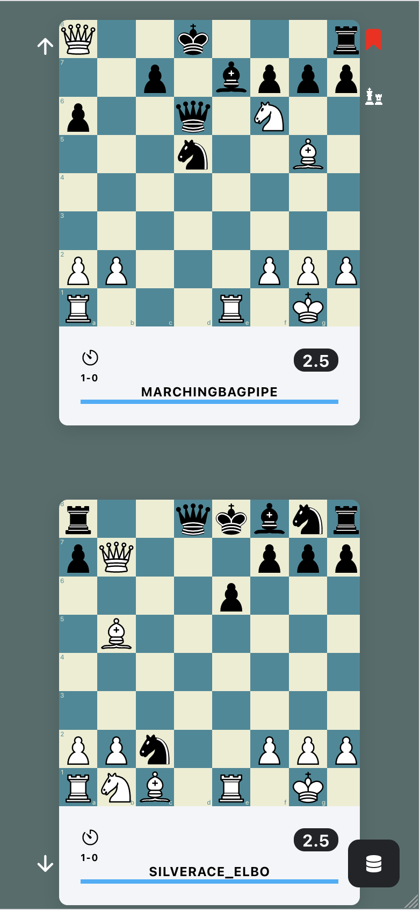

# chess-feed

## about

chess-feed is a demo of a web-based search filter for my chess games.

## background

Previously I created an analysis program,
[chess-analysis](https://github.com/cameron-terry/chess-analysis), which has game evaluations produced from Stockfish 12.

I wanted to create an app which allows me to access this information in a simple format designed around a mobile experience.
