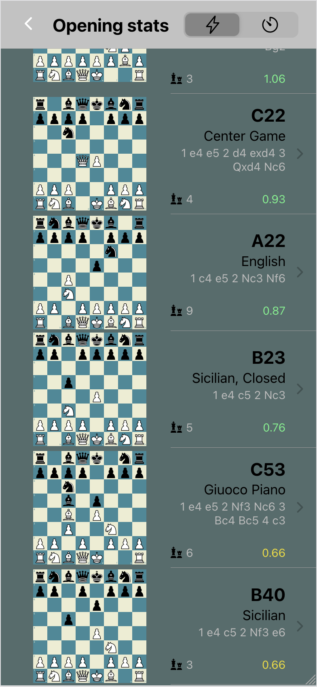

# chess-feed

## screenshots

<table>
  <tr>
    <td>Home View</td>
     <td>Card View</td>
     <td>Filter View</td>
     <td>Openings View</td>
     <td>Opening View</td>
  </tr>
  <tr>
    <td></td>
    <td></td>
    <td></td>
    <td></td>
    <td></td>
  </tr>
</table>

## about

chess-feed is a demo of a web-based search filter for my chess games built with React.

## background

Previously I created an analysis program,
[chess-analysis](https://github.com/cameron-terry/chess-analysis), which has game evaluations produced from Stockfish 14.

I wanted to create an app which allows me to access this information in a simple format, designed around a mobile experience.
